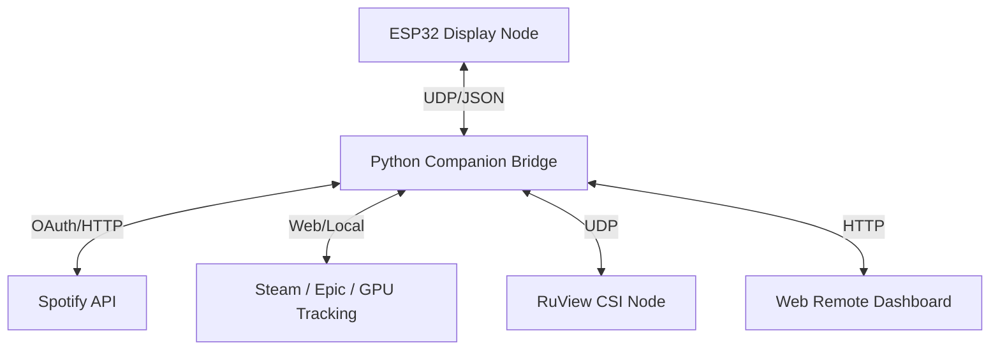

# CompanionOS Architecture

CompanionOS operates on a split-brain architecture, combining the real-time embedded capabilities of an ESP32 with the heavy-lifting power of a Python-based PC daemon.

## High-Level Diagram

## 1. ESP32 Core (Arduino/C++)

The ESP32 is responsible for all real-time visual rendering and hardware interactions.
- **Rendering Engine**: Uses `TFT_eSPI` for high-performance direct SPI writes. Rendering is explicitly segmented into pages (Theme 1, Theme 2 Spotify, Theme 3 RoboEyes) and relies on partial screen redraws (`fillRect` diffing) to maintain 50fps without flickering.
- **Networking (`companion_net.h`)**: Listens on `ESP_PORT_RX` (4210) for UDP packets from the PC. It parses incoming states (playback, volume, current game, CSI presence) and immediately updates volatile state variables.
- **Hardware Hack Tools (`dh_*_tools.h`)**: The Dr.Hack suite bypasses normal RTOS scheduling to execute raw 802.11 transmissions, BLE jamming, CC1101 radio tuning, and IR blasting.

## 2. Python Bridge (`companion_controller.py`)

The Python daemon acts as the intelligence broker. The ESP32 is too constrained to parse heavy JSON payloads, handle OAuth flows, or maintain complex TCP websockets.
- **Spotify Module**: Uses `spotipy` to maintain an active OAuth token. It offloads album art decoding by downloading the image, converting it to raw RGB565 binary chunks, and streaming it directly to the ESP32 TFT buffer over UDP.
- **Steam Tracker**: Utilizes `ctypes.windll.psapi` to inspect running processes. It specifically looks for loaded DirectX/Vulkan DLLs (`d3d11.dll`, `vulkan-1.dll`) to detect games not launched via Steam (e.g., Epic, Xbox Game Pass).
- **RuView CSI Integration**: Listens for raw `ADR-018` Wi-Fi CSI data from a secondary ESP32 node. It computes spatial variance thresholds to determine human occupancy and streams localized zones to the web app map.

## 3. Web Remote App

Served by a Flask thread inside `companion_controller.py`.
- **API Endpoints**: Translates HTTP POST requests from the browser into UDP `BTN:` commands for the ESP32.
- **RuView Map**: Queries the Flask `/api/ruview/state` endpoint to render a live SVG presence map of the room based on the CSI variance thresholds.
